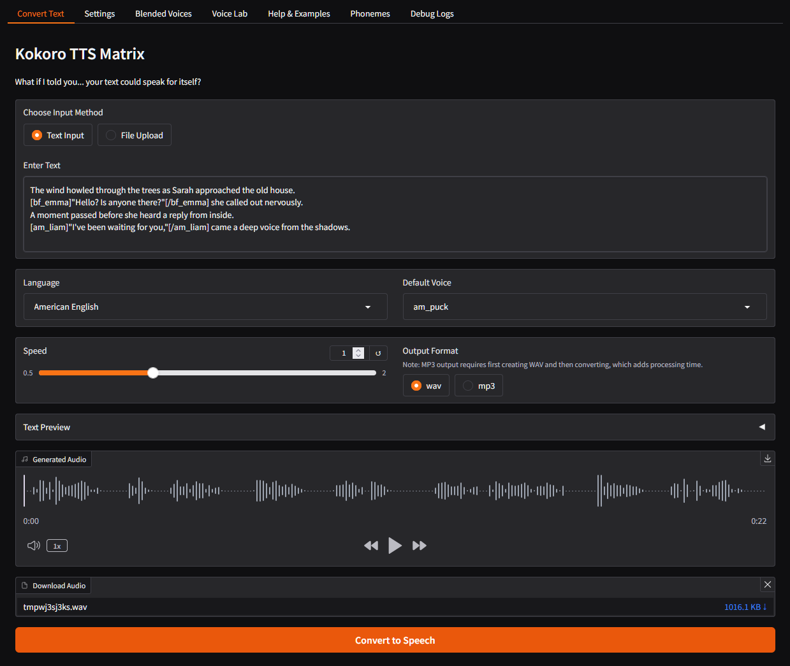

# Kokoro TTS Matrix 🎙️

[](https://www.python.org/downloads/)
[](https://developer.nvidia.com/cuda-toolkit)
[](LICENSE)

A powerful Gradio interface built on top of the Kokoro TTS (Text-to-Speech) model with advanced voice customization, blending, and audio processing capabilities.

## Audio Example

🔊 [Listen to Murderbot TTS excerpt](https://raw.githubusercontent.com/LostInMatrix/kokoro-tts-matrix/master/src/kokoro_matrix/assets/examples/martha-wells-murderbot.mp3)




## 🌟 Features

- **🔊 Voice Blending**: Create custom voices by combining existing voice models with adjustable weights
- **🎵 Audio Effects**: Add sound effects and customize silence settings
- **📝 Text Processing**: Smart text chunking algorithms for optimal TTS performance
- **📚 EPUB Support**: Convert e-books to audio with automatic chapter detection
- **📄 Text Files**: Process TXT files (recommended over EPUB for best accuracy)
- **🔄 Format Options**: Output to WAV or MP3 formats
- **✂️ Audio Splitting**: Create separate audio files for chapters, sections, or paragraphs
- **🔤 Phoneme Control**: Test your fine-tuned pronunciation with phoneme notation
- **🎙️ Dual Voice Paradigms**:
    - **Podcast Style**: Each speaker has their own voice (like a podcast with multiple hosts)
    - **Narrator Style**: One main narrator voice with character dialogue in different voices

## 🔧 Requirements

- Python 3.10+
- Kokoro TTS model (>=1.2.0)
- CUDA-compatible GPU (recommended)
- FFmpeg (for audio conversion)
- espeak-ng (for phoneme processing)

## 🚀 Installation

### Using Docker (Recommended)

1. Clone the repository:
   ```bash
   git clone https://github.com/LostInMatrix/kokoro-tts-matrix
   cd kokoro-tts-matrix
   ```

2. Run with Docker Compose:
   ```bash
   docker-compose up --build
   ```

3. Wait for the TTS models to download (this may take some time)

4. Access the Gradio interface at [http://localhost:7860](http://localhost:7860)

### Manual Installation

1. Install the required system dependencies:
   ```bash
   # Ubuntu/Debian
   sudo apt-get install espeak-ng portaudio19-dev libsndfile1 ffmpeg
   ```

2. Install Python dependencies:
   ```bash
   pip install -r requirements.txt
   ```

3. Run the application:
   ```bash
   python -m kokoro_matrix.gradio_interface
   ```

## 💡 Usage

### Basic Operation

1. Access the web interface at [http://localhost:7860](http://localhost:7860)
2. Select your input method (text or file upload)
3. Choose language and voice
4. Adjust speed and output format options
5. Click "Convert to Speech"

### Interface Tabs

- **Convert Text**: Main conversion tab for generating speech.
- **Settings**: Configure output options, sound effects, silence settings, and text formatting
- **Blended Voices**: Manage your custom voice files
- **Voice Lab**: Create new blended voices with the voice mixer
- **Help & Examples**: Documentation and usage examples
- **Phonemes**: Tools for customizing pronunciation
- **Debug Logs**: System logs for troubleshooting

### Voice Paradigms

Kokoro TTS Matrix supports two main approaches to voice assignment:

#### 1. Podcast Style
Each speaker has their own dedicated voice throughout the text. Perfect for dialogues, interviews, or multi-speaker content.

```
[af_bella]Welcome to today's discussion on AI. I'm your host, Bella.
[am_liam]And I'm Liam, joining as a special guest to talk about recent developments.
[af_bella]Let's start with the basics. Liam, what would you say is the most exciting trend?
```

#### 2. Narrator Style
One primary narrator voice with character dialogue in different voices. Ideal for audiobooks and storytelling.

```
The wind howled through the trees as Sarah approached the old house.
[bf_emma]"Hello? Is anyone there?"[/bf_emma] she called out nervously.
A moment passed before she heard a reply from inside.
[am_liam]"I've been waiting for you,"[/am_liam] came a deep voice from the shadows.
```

### Audio Effects

Kokoro Matrix supports various audio effects to enhance your narration:

#### Silence Effect
Add pauses between sections:

```
[effect:silence:2.5]
```
This adds a 2.5 second pause.

#### Sound Effects
Add predefined sound effects:

```
[af_bella]Let me tell you a story.
[effect:chime:80]
[am_liam]Once upon a time...
```
The number after the effect name controls volume (1-100).

#### Background Audio/Music
When enabled in Settings, you can add background audio that plays underneath your narration at a specified volume level.

### Voice Blending Tutorial

1. Go to the "Voice Lab" tab
2. Select primary, secondary, and tertiary voices
3. Adjust weight values for each voice
4. Test with sample text
5. Save your custom blend

### Phoneme Notation

Customize pronunciation using phoneme notation:

```
[Kokoro](/kˈOkəɹO/)
```

### File Preparation Tips

For best results with ebooks:
1. Use [Calibre](https://calibre-ebook.com/) to convert various ebook formats to TXT before processing
2. This provides more reliable text extraction than the built-in EPUB processor
3. Remove any page numbers, headers, or other formatting artifacts before processing

## 📁 File Storage

- `/app/outputs`: Default location for generated audio files
- `/app/user_voices`: Storage for custom voice blends

## 🙏 Acknowledgments

- [Official Kokoro TTS Model on Github](https://github.com/hexgrad/kokoro)
- [Official Kokoro TTS Model on Hugging Face](https://huggingface.co/hexgrad/Kokoro-82M)
- [TTS-Arena](https://huggingface.co/spaces/TTS-AGI/TTS-Arena)

## 🤝 Contributing

Contributions are welcome! Please feel free to submit a Pull Request.

## 📄 License

This project is licensed under the [Apache License 2.0](LICENSE).